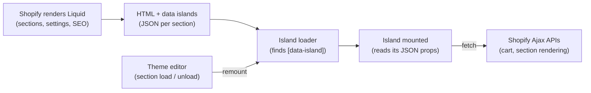

# shopify-modern

Modern front-end development for Shopify themes, without leaving the theme behind.

shopify-modern publishes **Pelago** (`@pelagojs/*`), an island runtime for Online Store 2.0 themes. Liquid still renders every page, so the theme editor, app blocks, SEO and Shopify's hosting work as usual. Vite, TypeScript and Vue components take over only the parts of the page that need JavaScript, and each one loads only when it's needed.

A section marks where an island goes and gives it its props as JSON:

```liquid
 sections/hello-world.liquid 
<div data-island="hello-island" data-island-id="{{ section.id }}">
  <p>This text is replaced when the Vue island mounts.</p>
  { "name": {{ shop.name | json }}, "greeting": {{ section.settings.greeting | json }} }
  
</div>
```

The island is a Vue component with the same name in `src/islands/`. Its prop types come from the section's ``:

```vue
<!-- src/islands/HelloIsland.vue -->
<script setup lang="ts">
import { ref } from 'vue'
import type { SectionSettings } from '../sections'

defineProps<{ name: string } & Pick<SectionSettings['hello-world'], 'greeting'>>()
const clicks = ref(0)
</script>

<template>
  <p>
    {{ greeting || 'Hello' }} from {{ name }}, mounted by Vue.
    <button type="button" @click="clicks++">Clicked {{ clicks }} times</button>
  </p>
</template>
```

How a page comes together:



## Why

Shopify themes are written in Liquid, and the usual way to use modern front-end tools with Shopify is to go headless, giving up the theme editor, app blocks and Shopify's hosting along with Liquid. Most stores need neither extreme: a theme that merchants can edit, with a few interactive parts (a product form, a cart drawer, a filter) built with real components. Pelago is that middle path. It works in any Online Store 2.0 theme, including Dawn and themes from the Theme Store.

**Arriving from an older link?** The 2017 shopify-modern mounted one Vue app over the whole page, with a client-side router. That model breaks the theme editor and app blocks, so it was replaced ([ADR 001](docs/decisions/001-islands-in-a-liquid-first-theme.md)). The 2017 code is kept at the tag [`v1`](https://github.com/dmccuskey/shopify-modern/tree/v1) and the branch [`legacy/v1`](https://github.com/dmccuskey/shopify-modern/tree/legacy/v1).

## Features

- **Server-rendered first:** every page is complete HTML before JavaScript runs, and each island holds fallback markup that works without it.
- **JavaScript per island, on demand:** a few KB of entry script, then each component (and Vue itself) loads only on pages that have it.
- **Loading rules:** either mount an island at once, when it scrolls into view, when the browser is idle, or on the first interaction.
- **Data islands:** each island reads its props from JSON rendered by its own section, keyed by the section's ID, so repeated sections never collide.
- **Theme editor support:** when a merchant edits a section, its islands remount with the new settings.
- **Typed props from section schemas:** TypeScript types for every section's settings, so renaming a setting fails the type check instead of breaking the store.
- **Shared cart, customer and locale stores** across islands, with a typed Ajax Cart client and `formatMoney` in the shop's own money format.
- **Cart sync with apps:** when an app changes the cart, the cart drawer and count update too.
- **Island inspector:** in development, a panel shows each island's loading rule, mount time, props size and bundle size.
- **Drops into an existing theme:** npm packages and one Vite plugin, with no Liquid files to copy. Vue first, with a framework-agnostic core.

## Quick Start

This runs the example theme, Shopify's skeleton theme with four Vue islands, in about 10 minutes on a Mac. At the end you will have it running on your development store with hot reload, and an island you changed yourself.

You need Node 22.12 or newer (`node --version`) and a Shopify development store, which you can create for free with a [Shopify Partner](https://www.shopify.com/partners) account. The Shopify CLI is installed with the example theme.

### 1. Get the code

```bash
git clone https://github.com/dmccuskey/shopify-modern.git
cd shopify-modern
npm install
```

### 2. Set your store

```bash
cp examples/theme-vue/shopify.theme.example.toml examples/theme-vue/shopify.theme.toml
```

Edit `examples/theme-vue/shopify.theme.toml` and set `store` to your development store, for example `your-dev-store.myshopify.com`. The file is gitignored.

### 3. Start the dev server

```bash
npm run dev
```

This builds the packages, then starts Vite and `shopify theme dev` together. The first time, the Shopify CLI asks you to log in in the browser, and, if the store is password protected, for the storefront password. It then uploads a development theme, which customers don't see, and prints the preview URL, usually `http://127.0.0.1:9292`.

Open the preview URL. The home page says "Hello from *your store's name*, mounted by Vue." with a button that counts clicks. If it still says "This text is replaced when the Vue island mounts.", the island didn't load: check the browser's console.

The `◆ 3 islands` button in the corner opens the island inspector (or press Alt+Shift+I): the countdown in the announcement bar, the hello island, and the cart drawer in the header. Product pages have the cart drawer and the product form.

**Going further:** the islands in the theme editor need `npm run dev:editor` instead ([Testing in the Theme Editor](docs/development.md#testing-in-the-theme-editor)).

### 4. Change an island

Open `examples/theme-vue/src/islands/HelloIsland.vue` and change the text in its `<template>`, for example `mounted by Vue` to `mounted by Vue, edited by me`. Save, and the page updates without a reload.

To update later, run `git pull` and `npm install` in the `shopify-modern` folder.

## Add an Island

This adds a free shipping note that updates with the cart, to the home page of the example theme.

**1. Write the component.** Every component directly in `src/islands/` is an island, named after its file: `FreeShipping.vue` is `free-shipping`. Create `examples/theme-vue/src/islands/FreeShipping.vue`:

```vue
<script setup lang="ts">
import { computed } from 'vue'
import { formatMoney } from '@pelagojs/shopify'
import { useCart } from '@pelagojs/vue'

const props = defineProps<{ threshold: number }>() // in cents, as Shopify counts money
const cart = useCart()
const left = computed(() => props.threshold - (cart.value?.total_price ?? 0))
</script>

<template>
  <p v-if="left > 0">Spend {{ formatMoney(left) }} more for free shipping.</p>
  <p v-else>Your order ships free.</p>
</template>
```

`useCart()` reads the shared cart store, so the note changes as soon as the product form or an app changes the cart.

**2. Mount it from a section.** In `examples/theme-vue/sections/hello-world.liquid`, add this after the `hello-island` element:

```liquid

<div data-island="free-shipping" data-island-id="{{ shipping_id }}" data-island-load="visible">
  <p>Free shipping on orders over {{ 5000 | money }}.</p>
  
</div>
```

The section already has an island, so this one's ID adds `-shipping` to the section's ID. The paragraph is the fallback, shown until the island mounts and if JavaScript fails. `data-island-load="visible"` waits until the island scrolls into view.

**3. Check it.** The page reloads with "Spend $50.00 more for free shipping." (in your store's currency), and the inspector lists `free-shipping` with its loading rule and mount time. Add a product to the cart, and the note changes without a reload.

**Going further:** [loading rules](docs/architecture.md#loading-rules), [typed settings](docs/architecture.md#settings-types) and the [shared stores](docs/architecture.md#dynamic-data-and-shared-state).

## Use It in Your Own Theme

Pelago works in any Online Store 2.0 theme built with Vite and [`vite-plugin-shopify`](https://github.com/barrel/shopify-vite). Install the packages:

```bash
npm install @pelagojs/islands @pelagojs/shopify @pelagojs/vue vue
npm install --save-dev @pelagojs/vite-plugin vite vite-plugin-shopify @vitejs/plugin-vue
```

Add the plugin to `vite.config.ts`:

```ts
import { defineConfig } from 'vite'
import vue from '@vitejs/plugin-vue'
import shopify from 'vite-plugin-shopify'
import pelago from '@pelagojs/vite-plugin'

export default defineConfig({
  plugins: [shopify({ sourceCodeDir: 'src' }), vue(), pelago()],
})
```

Start the islands from your entry script, loaded in `layout/theme.liquid` with ``:

```ts
// src/entrypoints/theme.ts
import { startIslands } from '@pelagojs/islands'
import { islands } from 'virtual:islands'

startIslands(islands)
```

Then add islands as above. The plugin writes `snippets/data-island.liquid`, `snippets/pelago-translations.liquid`, `src/sections.d.ts` and `src/translations.d.ts` on every dev run and build. Add `"@pelagojs/vite-plugin/client"` to `types` in `tsconfig.json` so TypeScript knows `virtual:islands`. The shared stores read the shop's locale, customer, cart and translations from a global data island in `layout/theme.liquid`; the example theme's [layout](examples/theme-vue/layout/theme.liquid) shows it.

## Documentation

- [Tutorial](docs/tutorial.md): how a Pelago theme works, from the files to the dev loop, with a walk-through of one island
- [Architecture](docs/architecture.md): how it works: data islands, the island runtime, loading rules, the theme editor, shared state, and the build
- [Example theme](examples/theme-vue/README.md): what the example contains, and what it changes from Shopify's skeleton theme
- [Development](docs/development.md): the dev loop, the theme editor, deploying, tests, and the roadmap
- [Architecture decisions](docs/decisions/): why it is built this way

Everything else is listed on the [documentation home](docs/README.md).

## How It Compares

- **[Hydrogen](https://hydrogen.shopify.dev/)** is Shopify's framework for headless storefronts in React, hosted on Oxygen. It suits stores that want a fully custom front end and can give up the theme editor and Liquid. Pelago keeps the theme and adds components to it.
- **Web components or plain JavaScript**, as in Dawn, need no build step and suit small interactive parts. Pelago suits themes that want components in a framework, TypeScript, and state shared between them.
- **[vite-plugin-shopify](https://github.com/barrel/shopify-vite)** builds a theme's JavaScript with Vite, and leaves how it runs on the page to you. Pelago builds on it and adds the runtime: data islands, loading rules, the theme editor lifecycle and shared stores.

## License

shopify-modern and Pelago are released under the [MIT License](LICENSE). The example theme's files come from Shopify's skeleton theme and are under [Shopify's license](examples/theme-vue/LICENSE.md).
