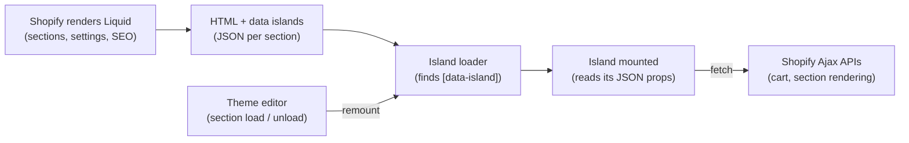

# Architecture

How Pelago, the island runtime that shopify-modern publishes, works: Liquid renders the page, and small components ("islands") are mounted into it, fed by JSON data islands and built with Vite.

> **Status:** this is the design for v2.0, written before the code. Sections are updated as each part is built. v2 is developed on the `v2` branch; the 2017 code is on [`legacy/v1`](https://github.com/dmccuskey/shopify-modern/tree/legacy/v1) and the tag [`v1`](https://github.com/dmccuskey/shopify-modern/tree/v1).

## Summary and Goals

v2 keeps Liquid in charge of the page and mounts small component islands into it. Each island reads its props from a JSON data island rendered by its own section. The 2017 version mounted one Vue app over the whole page with a client router; v2 drops that model because it breaks the theme editor, app blocks, SEO and Core Web Vitals (see [ADR 001](decisions/001-islands-in-a-liquid-first-theme.md)).

**Goals**

- Modern tooling inside a standard Online Store 2.0 theme: Vite, TypeScript, a component framework, hot reload, tests.
- Full theme editor support: merchants edit sections and settings, and islands update live.
- Server-rendered HTML first: every page is usable and indexable before JavaScript runs.
- JavaScript only for the interactive parts, loaded per island, on demand.
- A small, documented core (a data island reader and an island loader) that any OS 2.0 theme can adopt.

**Non-goals**

- A headless storefront or a full single-page app. Use [Hydrogen](https://hydrogen.shopify.dev/) or the Storefront API for that.
- Replacing Liquid for content, layout or SEO markup.
- Client-side routing between Shopify pages.

**Frameworks.** The core has no framework dependency; each framework gets a small adapter ([ADR 002](decisions/002-framework-agnostic-core-and-nanostores.md)). v2.0 ships the Vue 3 adapter. React, Svelte and web component adapters follow in v2.1 (see the [Roadmap](development.md#roadmap)).

## Overview

Shopify renders every page in Liquid as usual, and JavaScript only enhances marked regions. There is no `#vueapp` root and no client router.



1. A request reaches Shopify, which renders the layout and sections in Liquid. The HTML is complete and indexable.
2. Each interactive section outputs a mount element (`<div data-island="cart-drawer">`) and a JSON data island for it.
3. One small entry script (a few KB) finds the `[data-island]` elements and lazily imports only the components present on the page.
4. Each island mounts through its framework adapter, reading its props from its data island. Shared state (cart, customer) lives in framework-neutral stores.
5. Islands call Shopify's Ajax APIs for live changes. In the theme editor, section events unmount and remount the islands in that section.

## Packages

The repository is a monorepo of npm packages plus an example theme that installs them through the workspace, so the example uses exactly what users get ([ADR 003](decisions/003-monorepo-of-packages-and-example-theme.md)).

| Package | Provides |
|---|---|
| `@pelagojs/islands` (core) | `readProps`, island discovery, loading rules (`eager`, `visible`, `idle`, `interaction`), theme editor lifecycle, the adapter interface, and the island inspector (`@pelagojs/islands/inspector`, development only) |
| `@pelagojs/shopify` | `formatMoney`, a typed Ajax Cart client, a Section Rendering fetch helper, the translation lookup `t()`, and the shared `$cart`, `$customer`, `$locale` and `$translations` stores |
| `@pelagojs/vue` | The Vue 3 adapter (mount and unmount) and bindings for the stores |
| `@pelagojs/vite-plugin` | Builds the island registry from `src/islands/`, and writes the optional `data-island.liquid` snippet, the translations snippet, and the types of the section settings and translation keys into the theme on every dev run and build; starts the island inspector in dev and records each island's size at build |
| `@pelagojs/react`, `/svelte`, `/wc` | v2.1: the React, Svelte and web component adapters |

```text
shopify-modern/
├── packages/
│   ├── islands/          # core runtime and island inspector, no framework imports
│   ├── shopify/          # Shopify helpers and shared stores
│   ├── vue/              # Vue 3 adapter
│   └── vite-plugin/      # island registry, snippet and settings types generation
├── examples/
│   └── theme-vue/        # Shopify's skeleton theme with Vue islands
└── docs/
```

**No Liquid file is required.** npm can't install Liquid files into a theme, so the runtime doesn't depend on one: the JSON tag can sit inside the island's own mount element. The `data-island.liquid` snippet is a convenience. The Vite plugin keeps it current, and themes that don't use Vite get it once from `npx @pelagojs/islands init`. Setup for a user is `npm install`, one line in the Vite config, then writing components.

**Any OS 2.0 theme.** Most stores run a Theme Store theme (Dawn or a paid one) or a custom theme started from Dawn, so the packages must drop into any OS 2.0 theme. The example theme is Shopify's minimal skeleton theme, so the pattern is easy to read ([ADR 005](decisions/005-example-theme-on-skeleton-any-theme-supported.md)).

## Data Islands

Each island gets its data from a JSON script tag rendered by its own section and keyed by the section's ID. This is the 2017 pattern, scoped per section instead of per page.

**Liquid side:** the section renders the mount element, with server-rendered fallback markup, and its props:

```liquid
 sections/product-form.liquid 
<div data-island="product-form" data-island-id="{{ section.id }}">
   server-rendered fallback markup here 
</div>
{
  "product": {
    "id": {{ product.id }},
    "title": {{ product.title | json }},
    "variants": [
      {"id": {{ v.id }}, "price": {{ v.price }}, "available": {{ v.available }}, "options": {{ v.options | json }}}
      ,
    ]
  },
  "settings": {{ section.settings | json }}
}

```

```liquid
 snippets/data-island.liquid 
<script type="application/json" data-island-props="{{ id }}">{{ json }}</script>
```

**Forms that others read stay in Liquid.** An island replaces only its mount element's children. Shopify's dynamic checkout buttons (`{{ form | payment_button }}`) and some apps read the variant and quantity from the product form's `id` and `quantity` fields, and watch the form for changes. So an island that replaces a product form mounts inside the Liquid ``, with the payment button outside its mount element, renders fields with the same names, and handles the form's `submit`. The example theme's `product-form` island does this.

**JavaScript side:** a typed reader with no side effects on import:

```ts
export function readProps<T>(id: string): T | null {
  const el = document.querySelector(`script[data-island-props="${id}"]`)
  if (!el?.textContent?.trim()) return null
  return JSON.parse(el.textContent) as T
}
```

**Rules**

- One data island per section instance. The key is `section.id`, so repeated sections never collide.
- Serialize only what the island reads, as explicit shapes built in Liquid, not `| json` of whole objects. Data islands have a size budget per page ([ADR 006](decisions/006-data-island-payload-budgets.md)).
- Data used by several islands (cart, customer, locale, money format) goes in one `data-island-props="global"` tag in `layout/theme.liquid`.
- Missing data returns `null` without logging; islands handle it.
- TypeScript types describe the JSON shapes. The types of the `settings` are generated from each section's `` (see [Settings Types](#settings-types)).

## Island Runtime

One loader maps island names to lazily imported components, mounts each island it finds, and keeps a handle to unmount it. It is the only code that runs on every page.

```ts
// src/entrypoints/theme.ts
import { startIslands } from '@pelagojs/islands'
import { islands } from 'virtual:islands' // generated by the Vite plugin from src/islands/

startIslands(islands)
```

The Vite plugin generates the registry from the files directly in `src/islands/`. The island name is the file name in kebab case (`ProductForm.vue` is `product-form`), and the file extension picks the adapter (`.vue` uses the Vue adapter). For the two islands above, `virtual:islands` is:

```ts
const adapter0 = () => import('@pelagojs/vue').then((m) => m.vueAdapter)
export const islands = {
  'cart-drawer': { load: () => import('/src/islands/CartDrawer.vue'), adapter: adapter0 },
  'product-form': { load: () => import('/src/islands/ProductForm.vue'), adapter: adapter0 },
}
```

The adapter is imported lazily along with the component, so a page with no Vue islands doesn't load Vue, and the entry stays a few KB. A registry written by hand, for a theme without Vite, can pass the adapter itself instead of a function that imports it. Adding or deleting a file in `src/islands/` during `npm run dev` updates the registry and reloads the page. Components in subfolders of `src/islands/` aren't islands, so an island's parts can live next to it.

`startIslands` finds every `[data-island]` element once the DOM is ready and schedules it by its loading rule. When an island is due, the loader imports its component (and its adapter, if that's lazy), reads its props with `readProps(el.dataset.islandId)` (`{}` if there are none), and calls the adapter's `mount`. It keeps each island's unmount function, so an island is never mounted twice. It returns `mountIslands(root)` and `unmountIslands(root)`, for code that adds or removes islands itself, and `stop()`.

It also records when each island was scheduled, when its loading rule fired, and when it loaded and mounted, for the [island inspector](#island-inspector), and adds a `[pelago] <name>` measure to the browser's performance timeline for each mount, so islands show in DevTools' Performance panel. Both cost a few numbers per island, so they stay on in production.

- **Unknown islands** (a name not in the registry) are skipped, so islands from other code can share the page.
- **Failures are per island:** if a component fails to load or mount, the loader logs it with `console.error` and mounts the others. If it fails to load, the fallback markup stays.
- **Unmounting cancels:** unmounting an island that is still waiting for its loading rule, or still loading, stops it from mounting.
- A data island inside the mount element is replaced along with the fallback markup when the island mounts. The props are read first, but remounting the same element later finds no props; the theme editor always renders the section again, so this matters only for code that calls `mountIslands` itself.

An adapter answers one question: how to mount and unmount a component on an element with props. Each is about 30 to 50 lines, the same model [Astro](https://docs.astro.build/en/concepts/islands/) uses.

### Loading Rules

Set per island with `data-island-load`:

| Value | Mounts when | Use for |
|---|---|---|
| `eager` (default) | `DOMContentLoaded` | Above the fold, such as the product form |
| `visible` | an `IntersectionObserver` reports it on screen | Below the fold, such as reviews and recommendations |
| `idle` | `requestIdleCallback` fires (after 200 ms where it's missing, as in Safari) | Not urgent, such as the cart drawer |
| `interaction` | the first click, focus or hover (`click`, `focusin`, `pointerenter`) | Heavy and rarely used, such as a size guide |

An unknown value mounts eagerly, with a warning in the console. With `interaction`, the event that triggers the mount reaches the fallback markup, not the component, which isn't mounted yet.

### Theme Editor

Shopify fires `shopify:section:load` and `shopify:section:unload` when a merchant edits a section, with the section element as `event.target`, and they bubble to `document`. The loader listens there and calls `mountIslands` or `unmountIslands` on that element, so edits show live. `shopify:block:select` can be passed on to islands that need to reveal a block.

### Progressive Enhancement

Each mount element holds server-rendered fallback markup, for example a plain `<form action="/cart/add">`. The island replaces it on mount, so the page works before JavaScript loads and if it fails.

## Dynamic Data and Shared State

Islands never own page navigation. They fetch only what changes in place, from Shopify's theme endpoints, so no Storefront API token is needed.

| Need | Endpoint | Returns |
|---|---|---|
| Add to, update and read the cart | Ajax Cart API: `/cart/add.js`, `/cart/change.js`, `/cart.js` | JSON |
| Re-render a section after a change (cart count, filtered grid) | Section Rendering API: `?sections=<id>` or `?section_id=<id>` | HTML rendered by Liquid |
| Custom JSON for one resource | An alternate template, `?view=data` (`templates/product.data.liquid`) | JSON |
| Predictive search | `/search/suggest.json` | JSON |
| Product recommendations | `/recommendations/products.json` | JSON |

The alternate templates are named `data`, not `json`, because `product.json` is already the OS 2.0 template. They replace the 2017 `*.endpoint.liquid` templates.

**Rule of thumb:** if the result is markup that Liquid already knows how to render, use the Section Rendering API and swap the HTML. Use JSON when the island renders the result itself.

`@pelagojs/shopify` wraps the first two rows:

| Function | Calls | Does |
|---|---|---|
| `refreshCart()` | `/cart.js` | Fetches the cart into `$cart` |
| `addToCart(items)` | `/cart/add.js`, then `/cart.js` | Adds lines, returns them, and refreshes `$cart` |
| `changeCart(change)`, `updateCart(update)`, `clearCart()` | `/cart/change.js`, `/cart/update.js`, `/cart/clear.js` | Change the cart, and put the cart returned into `$cart` |
| `renderSections(ids, url?)` | `?sections=` | Returns the HTML of each section by ID, in the context of a page (the current one by default); five sections per request, as Shopify allows |
| `renderSection(id, url?)` | `?section_id=` | Returns one section's HTML |

The cart calls go under the locale's root URL (`/fr/cart/add.js` on a store with a French subfolder), as Shopify requires. The cart's types keep the API's own `snake_case` names, and list only the fields islands usually need. A refused change, such as a sold-out item, throws a `CartError` with Shopify's `description`, fit to show to the customer. `addToCart` refreshes `$cart` even then, because a refused add can still add part of the quantity ("Only 50 items were added to your cart due to availability."). When requests overlap, `$cart` keeps the cart from the one sent last, whichever order the responses arrive in.

The four cart changes take the Ajax Cart API's `sections` option, which renders sections with the change and saves a Section Rendering API request after it: `changeCart(change, { sections: ['cart-items'], sectionsUrl: '/cart' })`. With it, each returns what Shopify returns: the cart with a `sections` object of HTML by section ID, or for `addToCart`, `{ items, sections }` in place of the lines. `$cart` gets the cart without the sections. Shopify renders *at most* five sections with a change. When asked for more than five, Shopify still makes the change but silently drops the sections, and none are rendered. So sections beyond five are rendered with `renderSections` after the initial change. A refused change renders no sections.

**Shared state.** Stores are [nanostores](https://github.com/nanostores/nanostores), which have bindings for Vue, React and Svelte, so islands written in different frameworks share them ([ADR 002](decisions/002-framework-agnostic-core-and-nanostores.md)). They are small and scoped to one domain: `$cart` (the cart, as the Ajax Cart API returns it), `$cartOpen` (whether the cart drawer is open), `$customer` and `$locale`. The cart functions above update `$cart`, so a cart change in the product form updates the header's count at once.

**Cart sync with apps.** Apps change the cart with their own calls to the Ajax Cart API, such as an upsell's "Add" button, which would leave the drawer and the count stale. So the first time `$cart` is used, `@pelagojs/shopify` watches `fetch` and XHR, and refreshes `$cart` from `/cart.js` after each same-origin call to `/cart/add`, `/cart/change`, `/cart/update` or `/cart/clear` (with or without `.js`, under any locale root), whether Shopify accepted the change or not. The cart functions' own calls are left alone, since they update `$cart` already, and so are reads such as `/cart.js`. `fetch` and `XMLHttpRequest` are patched once per page, even if a theme bundles two copies of the package, and a page with no island using `$cart` isn't patched at all. Changes that don't go through `fetch` or XHR, such as a plain form post to `/cart/add`, load a new page, whose global data island has the new cart.

In a Vue island, `@pelagojs/vue` binds the stores with composables built on [`@nanostores/vue`](https://github.com/nanostores/vue): `useCart()`, `useCustomer()` and `useLocale()` return read-only refs, and `useCartOpen()` returns a writable one, so it works with `v-model`. Each subscribes for the life of the component and unsubscribes when the island unmounts. Changes go through the cart functions, not the refs. `useStore` is re-exported for a theme's own stores.

```vue
<script setup lang="ts">
import { useCart, useCartOpen } from '@pelagojs/vue'

const cart = useCart()
const open = useCartOpen()
</script>

<template>
  <button @click="open = true">Cart ({{ cart?.item_count ?? 0 }})</button>
</template>
```

The store code is part of an island's bundle only when the island uses it; the adapter alone doesn't load it.

The stores are seeded from the global data island the first time an island uses one, not on import, so the package has no side effects. Without a cart in the global data island, the first use of `$cart` fetches `/cart.js`. The global data island is rendered once in `layout/theme.liquid`; every field is optional:

```liquid
{
  "locale": {
    "language": {{ request.locale.iso_code | json }},
    "country": {{ localization.country.iso_code | json }},
    "currency": {{ cart.currency.iso_code | json }},
    "moneyFormat": {{ shop.money_format | json }},
    "rootUrl": {{ routes.root_url | json }}
  },
  "customer": {"id": {{ customer.id }}, "email": {{ customer.email | json }}, "firstName": {{ customer.first_name | json }}, "lastName": {{ customer.last_name | json }}}null,
  "cart": 
}

```

The `cart-json` snippet builds the cart with the fields of the `Cart` type, named and shaped as `/cart.js` has them, apart from the `token` and the image URLs, which are on the shop's own CDN path. `cart | json` would serialize every field of the Ajax Cart API, about 1.5 KB per line, against [ADR 006](decisions/006-data-island-payload-budgets.md)'s explicit shapes; the snippet is about 750 bytes per line. On the example theme's empty cart, the whole island is about 450 bytes.

**Money and translations.** Prices are formatted with `formatMoney(cents, moneyFormat)`, which defaults to the shop's `money_format` from `$locale`, not a hardcoded `$`. It handles all of Shopify's placeholders, such as `{{amount}}` and `{{amount_with_comma_separator}}`, and puts the sign first, as Liquid's `money` filter does (`-$1,234.56`). Translations come from the theme's own `locales/*.json` through `t('cart.title')`, so there is one source of truth: the build finds the keys the islands use, and Liquid renders those strings into the global data island (see [Translations](#translations)).

## Build and Dev Workflow

Vite builds each theme's source into its `assets/` folder, and Shopify CLI serves and syncs the theme. There is no copy step and no separate `dist/` theme.

```text
examples/theme-vue/
├── assets/              # the theme's own assets, plus Vite's output (vite-*, gitignored)
├── blocks/  config/  layout/  locales/
├── sections/            # sections that host islands
├── snippets/            # data-island.liquid, pelago-translations.liquid, vite-tag.liquid (generated, gitignored)
├── templates/           # *.json templates and *.data.liquid endpoints
├── src/
│   ├── entrypoints/
│   │   └── theme.ts     # entry: starts the island loader
│   ├── islands/         # one component per island
│   ├── sections.d.ts    # types of the section and block settings (generated, committed)
│   └── translations.d.ts # types of the translation keys (generated, committed)
├── vite.config.ts
└── package.json
```

`layout/theme.liquid` loads the entry with ``. `vite-plugin-shopify` writes that snippet on every build, pointing at the hashed files, and on every dev run, pointing at the Vite dev server.

Vite writes into `assets/`, which also holds the theme's own files, so the Pelago plugin sets the build not to empty it (`emptyOutDir: false`) and to name its files `vite-*`. After each build, it deletes the `vite-*` files that the build didn't write, so old hashed files don't pile up in the theme. It also writes `snippets/data-island.liquid` on every dev run and build, only when its content changed, so Shopify CLI doesn't upload it again for nothing. A theme's Vite config needs only the plugins:

```ts
// vite.config.ts
export default defineConfig({
  plugins: [shopify({ sourceCodeDir: 'src' }), vue(), pelago()],
})
```

The plugin's options change the island folder, the adapter for each file extension, the theme folder, the built files' prefix, whether it writes the snippet, the settings types and the translations, and where, and whether dev shows the island inspector. See `PelagoOptions` in `packages/vite-plugin/src/index.ts`. TypeScript learns the type of `virtual:islands` from `"types": ["@pelagojs/vite-plugin/client"]` in the theme's `tsconfig.json`.

### Settings Types

The plugin reads the `` of every `sections/*.liquid` and `blocks/*.liquid` and writes their settings as TypeScript types to `src/sections.d.ts`, on every dev run and build, and again in dev when a section or block file changes. Like the snippet, it writes only when the content changed. The file is committed: `npm run check` type-checks before it builds, so a fresh clone needs it.

It exports three types: `SectionSettings` (by section file name), `BlockSettings` (by theme block file name) and `SectionBlockSettings` (by section file name, then the type of a block defined in that section). Each setting gets the type of the value an island receives when the Liquid passes it with `| json`:

| Setting type | TypeScript type |
|---|---|
| `checkbox` | `boolean` |
| `range` | `number` |
| `number` | `number \| null` |
| `select`, `radio` | the union of the option values, e.g. `'small' \| 'large'` |
| `text_alignment` | `'left' \| 'center' \| 'right'` |
| `text`, `textarea`, `richtext`, `inline_richtext`, `html`, `liquid`, `url` | `string \| null` |
| resources, colors, fonts and anything else | `unknown`: the island gets the shape its Liquid builds |

`header` and `paragraph` settings have no value and are left out. A file whose schema isn't valid JSON is skipped with a warning; Theme Check reports the error.

Islands get explicit JSON shapes, not whole `section.settings` (see [Data Islands](#data-islands)), so an island picks the settings it receives from the type:

```liquid
{ "name": {{ shop.name | json }}, "greeting": {{ section.settings.greeting | json }} }
```

```vue
<script setup lang="ts">
import type { SectionSettings } from '../sections'

defineProps<{ name: string } & Pick<SectionSettings['hello-world'], 'greeting'>>()
</script>
```

Renaming or removing the `greeting` setting then fails the type check. The Liquid that builds the JSON is not checked against the types.

### Translations

Islands read the theme's strings with `t()` from `@pelagojs/shopify`, as Liquid does with the `t` filter:

```vue
<script setup lang="ts">
import { t } from '@pelagojs/shopify'
</script>

<template>
  <h2>{{ t('cart.title') }} <small>{{ t('cart.item_count', { count }) }}</small></h2>
</template>
```

The strings aren't bundled. Shopify serves one locale per request, and merchants change strings in the admin ("Edit default theme content", Translate & Adapt), which the theme's files don't hold, so only Liquid knows a page's strings. The plugin scans the code under `src/` for `t('…')` calls in files that import `t` from a `@pelagojs/` package, and writes `snippets/pelago-translations.liquid`, which renders each key it found with `| t | json`. `layout/theme.liquid` puts it in the global data island:

```liquid
"translations": 
```

A page carries only the strings the islands use: the example's 15 come to about 500 bytes, counted against the [ADR 006](decisions/006-data-island-payload-budgets.md) budget like the rest of the island. The plugin writes the snippet on every dev run and build, and again in dev when a file under `src/` or `locales/` changes. With no `t()` calls, it renders `{}`.

How `t()` follows the `t` filter:

- **Variables** fill `{{ name }}` placeholders: `t('gift_card.expires_on', { expires_on: date })`. Liquid renders the strings without variables, which leaves the placeholders for `t()`.
- **Plurals:** a key whose value is an object of plural forms (`one`, `other`, and `zero`, `two`, `few` or `many`) is rendered once per form any of the theme's locale files has. `t(key, { count })` picks the form for the count in the request's language with `Intl.PluralRules`, falling back to `other`.
- **HTML:** Liquid HTML-escapes the strings of keys without `_html`, so `t()` unescapes them and returns plain text, for `{{ }}` in a template. A key ending in `_html` returns HTML, with its variables escaped, for `v-html`.
- **A missing key** (not on the page, or rendered as `Translation missing: …`) returns the key itself, with one console warning.

The scan only reads string keys. A key built at runtime, such as ``t(`cart.${name}`)``, warns at build and goes in `pelago({ translations: { include: ['cart.remove'] } })`. A key missing from `locales/*.default.json` warns and is left out. The plugin also writes the keys of `locales/*.default.json`, each with its variables, to `src/translations.d.ts`, which adds them to `TranslationKeys` in `@pelagojs/shopify`. A misspelled key or variable then fails the type check. Like `sections.d.ts`, the file is committed. `pelago({ translations: false })` turns all of it off.

### Island Inspector

In `vite dev`, the plugin adds the island inspector to `virtual:islands`: a button in the corner of the page (`◆ 3 islands`) that opens a panel and outlines each island. Alt+Shift+I toggles it, and it remembers whether it was open. For each `[data-island]` on the page it shows:

| Column | From |
|---|---|
| Rule | `data-island-load`, as the runtime scheduled it (`eager` for an unknown rule) |
| Mount | Time from the loading rule firing to the adapter's `mount` returning; the tooltip splits it into load and mount, and the wait for the rule. Or `waiting`, `loading`, `failed`, and `not an island` for a name with no file in `src/islands/` |
| Props | The size of the island's own data island |
| Bundle | Gzipped size of the island's own code in the last `vite build`: its chunk, the chunks only it imports, and their CSS. Code the page loads anyway (the entry, the adapter and framework, chunks shared with other islands) isn't counted |

Below the table it adds up every `script[data-island-props]` on the page, shared ones like `global` included, against the 30 KB budget of [ADR 006](decisions/006-data-island-payload-budgets.md).

The bundle sizes come from the build: each `vite build` writes them to `node_modules/.vite/pelago-sizes.json`, and `vite dev` reads them when it starts, so they are as of the last build before `npm run dev`. The inspector is plain DOM in a shadow root, so the theme's CSS doesn't reach it and it needs no framework. Builds never include it; `pelago({ inspector: false })` turns it off in dev too. It is a separate entry of `@pelagojs/islands` because it reads the runtime's records, which aren't public API. The records live on `globalThis` under `Symbol.for('pelago.records')`, so the inspector sees them even when Vite's dev server gives it its own copy of the module: with the packages installed from npm, Vite prebundles the runtime first and the inspector in a later run.

| Concern | Choice | Note |
|---|---|---|
| Bundler | Vite with barrel's [`vite-plugin-shopify`](https://github.com/barrel/shopify-vite) | Writes hashed chunks to `assets/` and generates the snippet that emits the `<script>` tags, including the dev server's in development |
| Theme sync and preview | Shopify CLI (`shopify theme dev`) | Local preview with hot reload of Liquid; replaces Themekit |
| Language | TypeScript | |
| State | nanostores | Shared across islands and frameworks |
| Quality | ESLint, Prettier, `vue-tsc`, Theme Check | Theme Check lints the Liquid |
| Tests | Vitest for the packages, Playwright for smoke tests on a dev store | |
| CI | GitHub Actions | Format, lint, type check, tests, build, Theme Check; the data island budget comes with the example's smoke tests |

The commands are in [Development](development.md#build-and-test).

## What v2 Replaces

Most of v1 carries over as ideas rather than code; the 2017 app was mostly stubs.

| v1 piece | In v2 | Why |
|---|---|---|
| JSON data snippets (`*-data-script.liquid`) | **Kept** as a pattern, as one `data-island` snippet keyed by `section.id` | The core idea; scoping per section avoids collisions and works in the theme editor |
| `app-data.js` loader | **Rewritten** as `readProps()`, with no side effects on import | Three copy-pasted loaders, warnings on every page |
| `Product`, `Variant` and store models | **Replaced** by TypeScript types and nanostores | Variant writes weren't reactive; `setData` copied every field |
| `*.endpoint.liquid` templates | **Kept**, renamed `*.data.liquid`, and used | They were never called |
| `#vueapp` full-page mount and `vue-router` | **Dropped** | Breaks the theme editor, app blocks and SEO ([ADR 001](decisions/001-islands-in-a-liquid-first-theme.md)) |
| Views (`HomeView`, `BlogView`, …) | **Dropped** | Placeholders; Liquid sections render these pages |
| `ProductGridTile`, header search | **Ported** as islands where they need to be interactive, otherwise back to Liquid | |
| `i18n.js` and `en-default.js` | **Replaced** by keys from the theme's `locales/*.json` | Duplicated strings, no interpolation |
| `money` filter | **Replaced** by `formatMoney(cents, moneyFormat)` | Hardcoded `$` |
| Vendored Slate theme (`src/core/shopify/`) | **Replaced** by Shopify's skeleton theme in the example | Slate is deprecated |
| webpack 2, Babel 6, Themekit | **Replaced** by Vite and Shopify CLI | End of life |

## Decisions

The reasons behind the design are in the [architecture decision records](decisions/):

- [ADR 001](decisions/001-islands-in-a-liquid-first-theme.md): islands in a Liquid-first theme, not a full-page single-page app
- [ADR 002](decisions/002-framework-agnostic-core-and-nanostores.md): a framework-agnostic core with adapters, and nanostores for shared state
- [ADR 003](decisions/003-monorepo-of-packages-and-example-theme.md): a monorepo of npm packages plus an example theme
- [ADR 004](decisions/004-rewrite-in-the-same-repository.md): rewrite in the same repository, keeping v1 as a tag and a branch
- [ADR 005](decisions/005-example-theme-on-skeleton-any-theme-supported.md): the example theme on Shopify's skeleton theme, with support for any OS 2.0 theme
- [ADR 006](decisions/006-data-island-payload-budgets.md): data island payload budgets
- [ADR 007](decisions/007-pelago-name-and-npm-scope.md): the Pelago name and the `@pelagojs` npm scope
